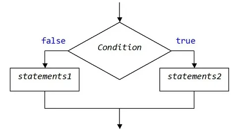
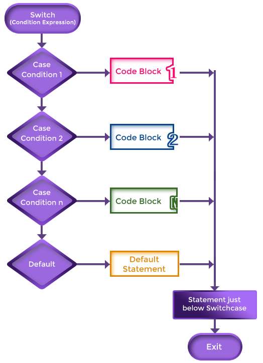

# Functions-Loops-Conditions
## Condition divided by three types
* ### Condition IF/ELSE Statment

* ### Condition TERNARY OPERATOR

* ### Condition Swich Statment

## Loops divided by three types
* ## Loop for
### for (let i=0 ; i<=10 ; i++)
### {
    console.log(i)
}

* ## Loop While
### let i = 0
### While (i <= 10)
### {
    i++
    console.log(i)
}

* ## Loop Do/While
### let i = 0
### DO
### {
    i++
    console.log(i)
} While(i <= 10)

## There are 3 ways to write functions in JavaScript
### 1.Function declaration

### function sum(num1 , num2)
### {
    return num1 + num 2
}
### console.log(sum(5 + 5))

### 2.Function Expression

* ### Arrow function
### let arrow = (number) =>{
    return number
}
### console.log(arrow(10))

* Anonymous function
### let anonymous = function (number)
### {
    return number
}
### console.log(anonymous(10))

### 3.IIFE
function(a , b)
{
    return a + b
}()